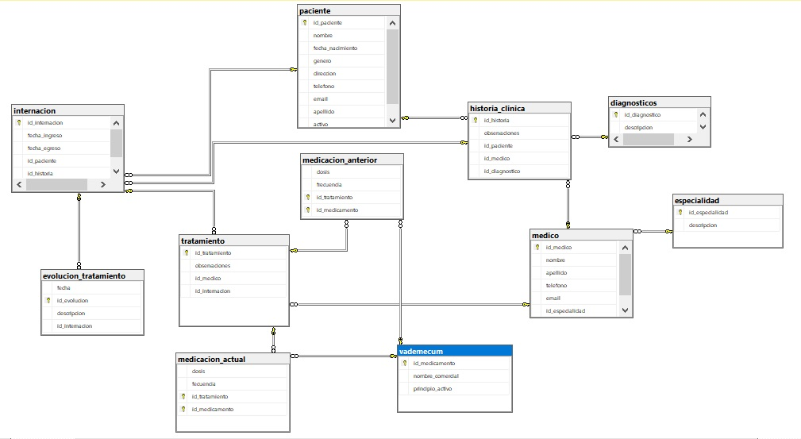

# 4. Desarrollo del Tema📜
A continuación presentaremos el desarrollo y los resultados que obtuvimos por parte de nuestra
investigación realizada pero antes para ponernos en contexto recordemos lo que se habló al
comienzo del presente trabajo de investigación:

Un trigger es un objeto asociado a una tabla que se activa automáticamente cuando se realiza una operación particular, estas "operaciones" son eventos que ocurren en la tabla:
**INSERT:** El trigger se activa cuando se inserta una nueva fila sobre la tabla asociada.
**UPDATE:** El trigger se activa cuando se actualiza una fila sobre la tabla asociada.
**DELETE:** El trigger se activa cuando se elimina una fila sobre la tabla asociada.

Una vez mencionado esto, pasaremos hablar primeramente de como realizamos el trigger para ello dentro del moto SQL Server tomamos la base de datos llamada "gestion_hospitalaria"

En donde nos posicionamos en ella y ejecutamos la siguiente sentencia:

# Diccionario de Datos

## 1. Tabla: paciente

| Columna            | Tipo de Dato      | Descripción                                    |
|--------------------|-------------------|------------------------------------------------|
| `id_paciente`      | NUMERIC(15)       | Identificador único del paciente (clave primaria). |
| `nombre`           | CHAR(30)          | Nombre del paciente.                           |
| `fecha_nacimiento` | DATE              | Fecha de nacimiento del paciente.              |
| `genero`           | CHAR              | Género del paciente.                           |
| `direccion`        | VARCHAR(80)       | Dirección del paciente.                        |
| `telefono`         | NUMERIC(16)       | Teléfono del paciente.                         |
| `email`            | VARCHAR(100)      | Correo electrónico del paciente.               |
| `apellido`         | CHAR(30)          | Apellido del paciente.                         |
| `activo`           | BIT               | Estado activo del paciente (1=activo, 0=inactivo). |

---

## 2. Tabla: especialidad

| Columna            | Tipo de Dato      | Descripción                                    |
|--------------------|-------------------|------------------------------------------------|
| `id_especialidad`  | INT               | Identificador único de la especialidad (clave primaria). |
| `descripcion`      | VARCHAR(50)       | Descripción de la especialidad.                |

---

## 3. Tabla: diagnosticos

| Columna            | Tipo de Dato      | Descripción                                    |
|--------------------|-------------------|------------------------------------------------|
| `id_diagnostico`   | INT               | Identificador único del diagnóstico (clave primaria). |
| `descripcion`      | VARCHAR(MAX)      | Descripción del diagnóstico.                   |

---

## 4. Tabla: vademecum

| Columna            | Tipo de Dato      | Descripción                                    |
|--------------------|-------------------|------------------------------------------------|
| `id_medicamento`   | INT               | Identificador único del medicamento (clave primaria). |
| `nombre_comercial` | VARCHAR(MAX)      | Nombre comercial del medicamento.              |
| `principio_activo` | VARCHAR(MAX)      | Principio activo del medicamento.              |

---

## 5. Tabla: medico

| Columna            | Tipo de Dato      | Descripción                                    |
|--------------------|-------------------|------------------------------------------------|
| `id_medico`        | INT               | Identificador único del médico (clave primaria). |
| `nombre`           | CHAR(40)          | Nombre del médico.                             |
| `apellido`         | CHAR(40)          | Apellido del médico.                           |
| `telefono`         | NUMERIC(15)       | Teléfono del médico.                           |
| `email`            | VARCHAR(60)       | Correo electrónico del médico.                 |
| `id_especialidad`  | INT               | Identificador de la especialidad del médico (clave foránea de `especialidad`). |

---

## 6. Tabla: historia_clinica

| Columna            | Tipo de Dato      | Descripción                                    |
|--------------------|-------------------|------------------------------------------------|
| `id_historia`      | INT               | Identificador único de la historia clínica (clave primaria). |
| `observaciones`    | VARCHAR(100)      | Observaciones generales de la historia clínica. |
| `id_paciente`      | NUMERIC(15)       | Identificador del paciente (clave foránea de `paciente`). |
| `id_medico`        | INT               | Identificador del médico (clave foránea de `medico`). |
| `id_diagnostico`   | INT               | Identificador del diagnóstico (clave foránea de `diagnosticos`). |

---

## 7. Tabla: internacion

| Columna            | Tipo de Dato      | Descripción                                    |
|--------------------|-------------------|------------------------------------------------|
| `id_internacion`   | INT               | Identificador único de la internación (clave primaria). |
| `fecha_ingreso`    | DATE              | Fecha de ingreso del paciente.                 |
| `fecha_egreso`     | DATE              | Fecha de egreso del paciente.                  |
| `id_paciente`      | NUMERIC(15)       | Identificador del paciente (clave foránea de `paciente`). |
| `id_historia`      | INT               | Identificador de la historia clínica (clave foránea de `historia_clinica`). |

---

## 8. Tabla: evolucion_tratamiento

| Columna            | Tipo de Dato      | Descripción                                    |
|--------------------|-------------------|------------------------------------------------|
| `fecha`            | DATETIME          | Fecha y hora de la evolución del tratamiento.  |
| `id_evolucion`     | INT               | Identificador único de la evolución (clave primaria). |
| `descripcion`      | VARCHAR(MAX)      | Descripción de la evolución del tratamiento.   |
| `id_internacion`   | INT               | Identificador de la internación (clave foránea de `internacion`). |

---

## 9. Tabla: tratamiento

| Columna            | Tipo de Dato      | Descripción                                    |
|--------------------|-------------------|------------------------------------------------|
| `id_tratamiento`   | INT               | Identificador único del tratamiento (clave primaria). |
| `observaciones`    | VARCHAR(100)      | Observaciones sobre el tratamiento.            |
| `id_medico`        | INT               | Identificador del médico que realiza el tratamiento (clave foránea de `medico`). |
| `id_internacion`   | INT               | Identificador de la internación asociada al tratamiento (clave foránea de `internacion`). |

---

## 10. Tabla: medicacion_anterior

| Columna            | Tipo de Dato      | Descripción                                    |
|--------------------|-------------------|------------------------------------------------|
| `dosis`            | VARCHAR(35)       | Dosis del medicamento anterior.                |
| `frecuencia`       | VARCHAR(35)       | Frecuencia de administración del medicamento anterior. |
| `id_tratamiento`   | INT               | Identificador del tratamiento (clave foránea de `tratamiento`). |
| `id_medicamento`   | INT               | Identificador del medicamento (clave foránea de `vademecum`). |

---

## 11. Tabla: medicacion_actual

| Columna            | Tipo de Dato      | Descripción                                    |
|--------------------|-------------------|------------------------------------------------|
| `dosis`            | VARCHAR(35)       | Dosis del medicamento actual.                  |
| `fecuencia`        | VARCHAR(35)       | Frecuencia de administración del medicamento actual. |
| `id_tratamiento`   | INT               | Identificador del tratamiento (clave foránea de `tratamiento`). |
| `id_medicamento`   | INT               | Identificador del medicamento (clave foránea de `vademecum`). |

---

<table>
  <tr>
    <td><a href="Cap3.md"><button style="border-radius: 7px; padding: 10px 20px;">Anterior</button></a></td>
    <td><a href="Cap5.md"><button style="border-radius: 7px; padding: 10px 20px;">Siguiente</button></a></td>
  </tr>
</table>