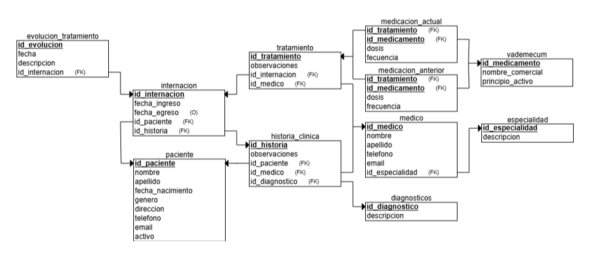

# Diagrama Relacional - Gestor de Historias Clínicas, Medicaciones y Pacientes Internados

# Descripción del Trabajo Práctico
Este trabajo práctico se centra en el desarrollo de un modelo de diagrama relacional (y su posterior base de datos) con el objetivo de optimizar la gestión de información médica relacionada con pacientes internados.
Se investigará la estructura y las relaciones entre las entidades clave que componen el sistema: Pacientes, Historias Clínicas, Internaciones, Médicos, Medicaciones y Tratamientos para un buen planteamiento de la base. Y su relacion con el tema de estudio asignado: **triggers**

El objetivo a mayor escala es abordar el problema de la fragmentación de la información en el ámbito de la salud, que puede dificultar el seguimiento de la atención médica.

Asimismo realizar las consecuentes automatizaciones sobre la misma mediante el uso de los desencadenadores.

  Diagrama 1: Diagrama ERD del presente trabajo

Este modelo permite gestionar eficientemente la información clínica de los pacientes, sus internaciones y las medicaciones recetadas, asegurando una visión clara y centralizada de su historial médico.

- [**Capítulo 1:** Introducción 📑](Cap1.md)
- [**Capítulo 2:** Marco conceptual 📝](Cap2.md)
- [**Capítulo 3:** Metodología 🧠](Cap3.md)
- [**Capítulo 4:** Desarrollo 📜](Cap4.md)
- [**Capítulo 5:** Conclusiones 💡](Cap5.md)
- [**Capítulo 6:** Bibliografía 📚](Cap6.md)

